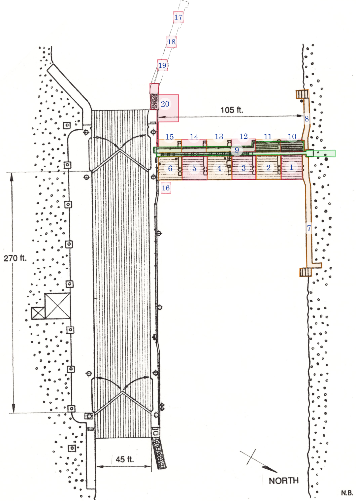

# Plan du site

Voici le découpage du site de l'écluse en zones.

<figure>
    
    <figcaption>Découpage du site en zones. Dessin original de Nick Baets (1988) Source: <cite><a href="https://saveontarioshipwrecks.ca/chapter-ottawa/">Save Ontario Shipwrecks - Ottawa chapter</a></cite></figcaption>
</figure>

## Description des zones

### Zone 1

Première enclave à l'est des évacuateurs, à l'extrémité nord. Comprends:

- le plancher, incluant le rebord à l'extrémité est
- le murs ouest

Exclue le mur qui jouxte au nord, la passerelle et le pilier au sud.

### Zone 2

Enclave au sud de la zone 1. Comprends:

- le plancher, incluant le rebord à l'extrémité est
- le murs ouest
- le pillier au nord

### Zone 3

Enclave au sud de la zone 2. Comprends:

- le plancher, incluant le rebord à l'extrémité est
- le murs ouest
- le pillier au nord
- ??? sluice gate ???

### Zone 4

Enclave au sud de la zone 3. Comprends:

- le plancher, incluant le rebord à l'extrémité est
- le murs ouest
- le pillier au nord

### Zone 5

Enclave au sud de la zone 4. Comprends:

- le plancher, incluant le rebord à l'extrémité est
- le murs ouest
- le pillier au nord

### Zone 6

Enclave au sud de la zone 5. Comprends:

- le plancher, incluant le rebord à l'extrémité est
- le murs ouest
- le pillier au nord

Exclue le mur qui jouxte au sud.

### Zone 7

Mur nord comprenant:

- Le dessus situé à - 35 pieds de profondeur
- La structure en escaliers tout à l'est

### Zone 8

Mur nord à l'ouest du déversoir. Comprends:

- Le dessus situé à -35 pieds de profondeur
- La structure en escaliers au bout, à l'ouest

### Zone 9

Passerelle nord/sud située au-dessus du déversoir. Inclue:

- Les rambardes
- Les marches à l'extrémité sud
-
