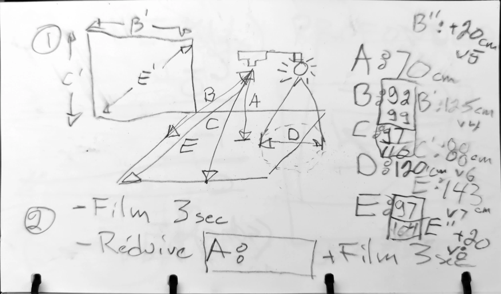
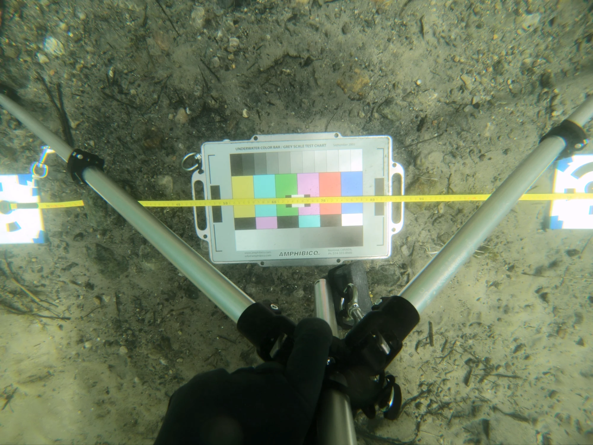

# Dimensions du rig de caméra

## Champs de vision de la lentille

Rectangle mesuré au sol, la lentille de la caméra placée à 70cm au-dessus, orienté parallèlement au sol via un trépied.

Distance lentille &lt;-&gt; sol: 70cm

### Mesurage

La prise de mesures des dimensions du champs de vision de la lentille de la GoPro s'est avéré plus difficile que prévu. En effet, il

<figure>
    
    <figcaption>Plan de plongée dessiné dans un carnet immergeable</figcaption>
</figure>

<figure>
    
    <figcaption>Image utilisée pour mesurer le champs de vision horizontal</figcaption>
</figure>

<figure>
    
    <figcaption>Image utilisée pour mesurer le champs de vision vertical</figcaption>
</figure>

<figure>
    
    <figcaption>Image utilisée pour mesurer le champs de vision diagonal</figcaption>
</figure>

Côté long "B": 125cm mesuré + 1,5cm, soit la demi largeur du cercle noir de la cible en excédent (à gauche) = 126,5cm

Côté court "C": 88cm mesuré + 1,5cm, soit la demi largeur du cercle noir de la cible en excédent (en haut) + 7,5cm ( ½ _ hauteur de la cible) + 4,5cm (0,3 _ hauteur de la cible en excédent en bas): 101.5cm

Diagonale "E": 155,6cm mesuré par règle de trois

## Angles de vue de la lentille

Spécifications du fabricant. 4:4 W (zoom=0%)

|             | Angle         |
| ----------- | ------------- |
| Diagonale   | 149.5 degrés |
| Horizontale | 122.6 degrés |
| Verticale   | 94.4 degrés  |

Source: [https://community.gopro.com/s/article/hero6-black-field-of-view-fov-information?language=en_US]

D'après les mesures obtenues plus haut:

|             | Angle      |
| ----------- | ---------- |
| Diagonale   | 96 degrés |
| Horizontale | 84 degrés |
| Verticale   | 72 degrés |

### Ratios des angles du champs de vision expérimentation / spécification

|             | Spécification | Mesurée | Ratio |
| ----------- | -------------- | -------- | ----- |
| Diagonale   | 149.5          | 96       | 0,642 |
| Horizontale | 122.6          | 84       | 0,685 |
| Verticale   | 94.4           | 72       | 0,763 |

[TODO: revoir cette section: la déformation de la lentille fait en sorte que l'angle de vue est plus grand sur les côtés. Pour le projet, j'ai choisis l'angle de vue utile, soit celui mesuré au centre de l'image.]

La mesure la plus fiable est celle **horizontale** puisque les cibles sont les mieux positionnés à la prise de vue, et que la mesure a été faire au centre (par opposition à la mesure verticale qui a été faite sur l'extrémité du champs de vue de la caméra, là où la distorsion de la lentille est au plus fort).

### Angle des lampes

81,2 degrés de diagonale.

Les mesures ont été effectuées en utilisant un trépied immergé sous l'eau et posé sur un fond rocailleux plat. La lampe était située à 70 cm de la surface mesurée. La diagonale mesurée est de 120 cm.

## Rig

Mesurer, en centimètres, les distances entre les lampes du rig une fois les lampes positionnées de façon à fournir un éclairage uniforme sur un plan situé à la distance "normale" de prise de mesures. Ceci permettera de modéliser finement le rig.

La mesure "X" est la distance horizontale entre les centres des 2 lampes du haut. La mesure "Y" est la distance verticale entre les 2 lampes de droite.

1. Distance X: 60cm
2. Distance Y: 40cm
3. Distance entre la lentille de la caméra et le plan filmé: 70cm
