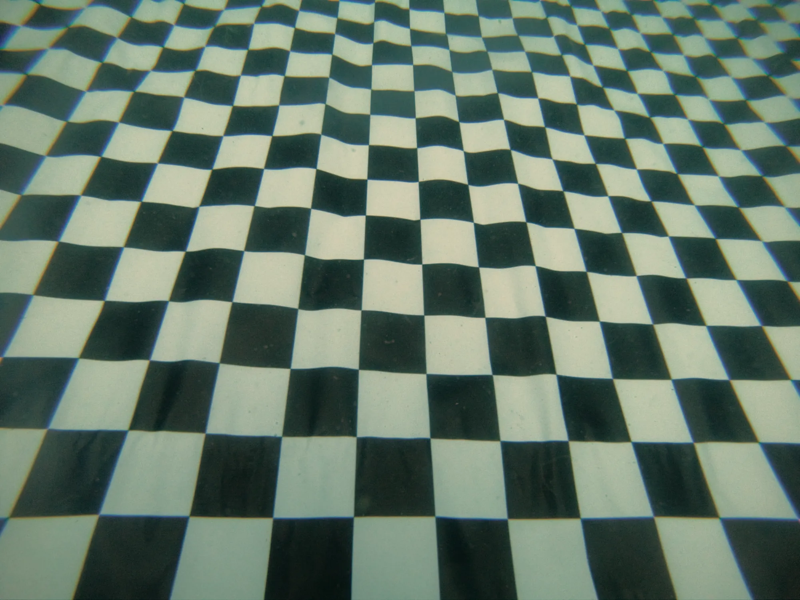

# Effet de bananne

Le test effectué sur une surface plane de 100 pieds de long montre que le modèle résultant de l'alignement des caméras dans le logiciel de photogrammétrie est déformé. Au lieu d'obtenir une surface plate, celle-ci est courbée en forme de bananne.

- D'où vient cette déformation?
- Comment la corriger?

### Hypothèse

On présume que l'effet bananne vient de la déformation des images par la lentille de la caméra GoPro Hero 6 Black.

Des tests effectuées sur un même jeu d'images - les fichiers `data/2024-05-18/raw-frames-n8/échelle-1` - en utilisant 2 fichiers de calibration de caméra différents, soit celui obtenu à partir du rendu par Metashape du jeu `data/2024-05-18/raw-frames-n8/pilier-3`, `configs/camera-calibration/camera-calibration from 2024-05-18 pillier 3.xml` et le fichier utilisé pour le projet Robert Gaskin `configs/camera-calibration/GoPro HERO6 4k wide frame camera calibration.xml` donnent des courbures différentes: le rendu fait avec la calibration provenant du projet Robert Gaskin a une courbure plus atténuée. On peut donc jouer avec la calibration de la caméra pour corriger l'effet bananne.

### Solutions envisagées

1. Effectuer une calibration de la caméra
2. Rogner les bords des images via un masque
3. Utiliser une lentille de moins grand angle

### Calibration de la caméra

Effectuer une collecte de données pour calibrer la lentille de la GoPro.

Calibration Best Practices: [https://calib.io/blogs/knowledge-base/calibration-best-practices](https://calib.io/blogs/knowledge-base/calibration-best-practices)

### En détails

Puisque la longueur focale de la lentille varie en fonction du milieu, le test doit se faire sous l'eau.

Choisir un plan d'eau calme, sans courant, avec la meilleur visibilité possible. Une piscine ou une carrière par exemple.

Le test sera fait à la carrière Bédard à Kahnawake, dimanche le 26 mai 2024.

Afin de s'assurer une bonne collecte de données, et éviter que les images obtenues ne soient pas trop surexposées, effectuer les tests qui suivent avec 4 lampes, puis avec 2 lampes.

1. Déposer un grand damier sur une surface plane. Éviter autant que possible de soulever des sédiments pour ne pas nuire à la visibilité.
2. Faire de brèves vidéos (3 secondes) en 4K 4:3 du damier de tous les angles possibles. Couvrir tout le champ de vision de la caméra avec le damier

<figure>
    
    <figcaption>Image utilisée pour calculer la calibration de la lentille</figcaption>
</figure>

### Traitement dans Metashape

3 échantillons de données ont été créés en filmant un segment de 100 pieds de long du plancher de bois situé derrière les évacuateurs. La distance de 100 pieds a été mesurée à l'aide d'un ruban à mesurer. Les positions 0' et 100' ont été identifiées à l'aide de 2 cibles.

<figure>
    
    <figcaption>Cible utilisée pour identifier la position à 100 pieds</figcaption>
</figure>

#### Échantillon 1

Vidéo effectuée à la palme en utilisant le format 4K 16:9.

### Conclusions
