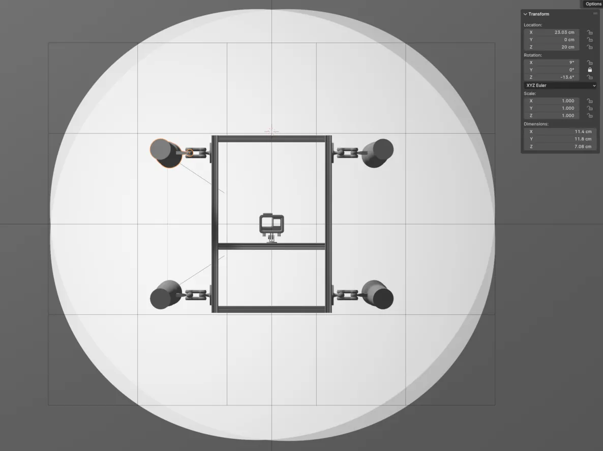

# Variation du paramètre ISO minimum

Scans d'une bande horizontale de 50 pieds de long en variant le paramètre ISO minimum, et en utilisant une configuration des lampes concentrée et distribuée.

|         | ISO minimum | Configration des lampes |
| :-----: | :---------: | :---------------------: |
| Série 1 |     100     |       concentrée        |
| Série 2 |     100     |       distribuée        |
| Série 3 |     200     |       distribuée        |
| Série 4 |     400     |       distribuée        |
| Série 5 |     400     |        concentré        |

## Configuration des lampes

<figure>
    
    <figcaption>Illustration de la configuration des lampes centrée</figcaption>
</figure>

<figure>
    
    <figcaption>Illustration de la configuration des lampes distribuée</figcaption>
</figure>

## Concentré vs distribué
