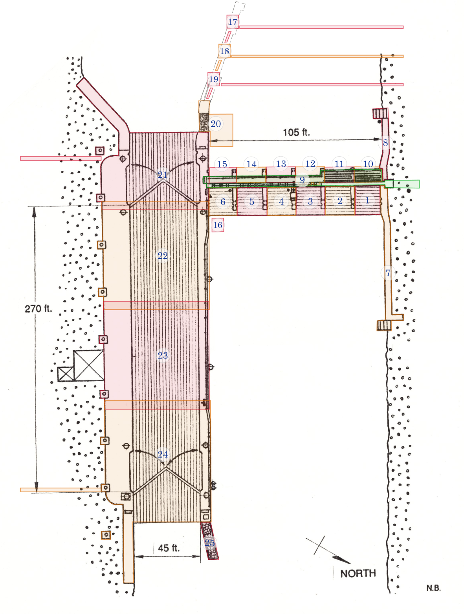

---
---

# Découpage du site

Voici le découpage du site de l'écluse en zones.

<figure>

    <figcaption>Découpage du site en zones. Dessin original de Nick Baets (1988) Source: <cite><a href="https://saveontarioshipwrecks.ca/chapter-ottawa/">Save Ontario Shipwrecks - Ottawa chapter</a></cite></figcaption>

</figure>

## Description des zones

### Zone 1

Première enclave à l'est des évacuateurs, à l'extrémité nord. Comprends:

- le plancher, incluant le rebord à l'extrémité est
- le mur ouest, les arches ainsi que les 3 faces du rebord au-dessus

Exclue le mur qui jouxte au nord, la passerelle et le pilier au sud.

### Zone 2

Enclave au sud de la zone 1. Comprends:

- le plancher, incluant le rebord à l'extrémité est
- le mur ouest, les arches ainsi que les 3 faces du rebord au-dessus
- le pillier au nord

### Zone 3

Enclave au sud de la zone 2. Comprends:

- le plancher, incluant le rebord à l'extrémité est
- le mur ouest, les arches ainsi que les 3 faces du rebord au-dessus
- le pillier au nord

Exclue les 3 passages des vannes ouvertes

### Zone 4

Enclave au sud de la zone 3. Comprends:

- le plancher, incluant le rebord à l'extrémité est
- le mur ouest, les arches ainsi que les 3 faces du rebord au-dessus
- le pillier au nord

### Zone 5

Enclave au sud de la zone 4. Comprends:

- le plancher, incluant le rebord à l'extrémité est
- le mur ouest, les arches ainsi que les 3 faces du rebord au-dessus
- le pillier au nord

### Zone 6

Enclave au sud de la zone 5. Comprends:

- le plancher, incluant le rebord à l'extrémité est
- le mur ouest, les arches ainsi que les 3 faces du rebord au-dessus
- le pillier au nord

Exclue le mur adjacent au sud.

### Zone 7

Mur nord comprenant:

- Le dessus situé à - 35 pieds de profondeur
- La structure en escaliers tout à l'est

### Zone 8

Mur nord à l'ouest du déversoir. Comprends:

- Le dessus situé à -35 pieds de profondeur
- La structure en escaliers au bout, à l'ouest

### Zone 9

Passerelle nord/sud située au-dessus des déversoirs. Inclue:

- Les rambardes
- Les marches à l'extrémité sud
- Les marches à l'extrémité nord

### Zone 10

Première enclave à l'ouest des évacuateurs, à l'extrémité nord. Comprends:

- le plancher de bois
- le mur est
- l'intérieur de la voûte, incluant les arches
- la face nord du pilier au sud

### Zone 11

Enclave au sud de la zone 10. Comprends:

- le pilier au nord, incluant la face nord allant jusqu'à la première cannelure
- le plancher de bois
- le mur est
- l'intérieur de la voûte, incluant les arches
- la face nord du pilier au sud

### Zone 12

Enclave au sud de la zone 11. Comprends:

- le pilier au nord, incluant la face nord allant jusqu'à la première cannelure
- le plancher de bois
- le mur est
- l'intérieur des 3 passages des vannes ouvertes
- l'intérieur de la voûte, incluant les arches
- la face nord du pilier au sud

### Zone 13

Enclave au sud de la zone 12. Comprends:

- le pilier au nord, incluant la face nord allant jusqu'à la première cannelure
- le plancher de bois
- le mur est
- l'intérieur de la voûte, incluant les arches
- la face nord du pilier au sud

### Zone 14

Enclave au sud de la zone 13. Comprends:

- le pilier au nord, incluant la face nord allant jusqu'à la première cannelure
- le plancher de bois
- le mur est
- l'intérieur de la voûte, incluant les arches
- la face nord du pilier au sud

### Zone 15

Enclave au sud de la zone 14. Comprends:

- le pilier au nord, incluant la face nord allant jusqu'à la première cannelure
- le plancher de bois
- le mur est
- l'intérieur de la voûte, incluant les arches
- la face nord du pilier au sud

### Zone 16

Porte d'une vanne de déversoir.

### Zone 17

#### Zone 18

#### Zone 19

#### Zone 20

#### Zone 21

#### Zone 22

#### Zone 23

#### Zone 24

#### Zone 25
